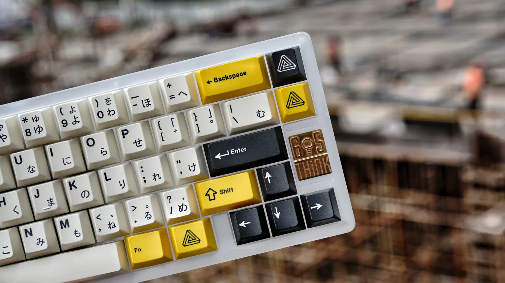
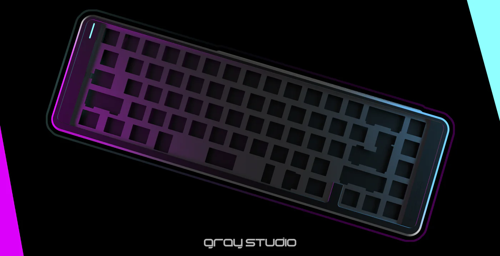

# ✌️ GrayStudio 造键坞



### Emonda60 G·Works 04 _（2025）_




### Macross65 G·Works 02_（2024）_




### Space82_（2024）_




### BD60_（2023）_




### Think6.5 V3_（2023）_




### Aero75_（2022）_




### Space65 R3_（2022）_




### Space80_（2021）_




### Think6.5 V2_（2020）_




### Space65 R2 Cybervoyager_（2020）_




### Think6.5 V1_（2019）_

<figure><figcaption>
<a data-mention href="think6.5-v1.md">think6.5-v1.md</a>
</figcaption></figure>



### Space65 R1_（2018）_

<figure><figcaption>
<a data-mention href="space65-r1.md">space65-r1.md</a>
</figcaption></figure>




### HB85_（2018）_




### COD67 R1 & R2_（2017-2018）_



